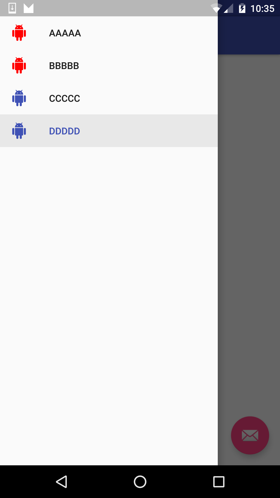
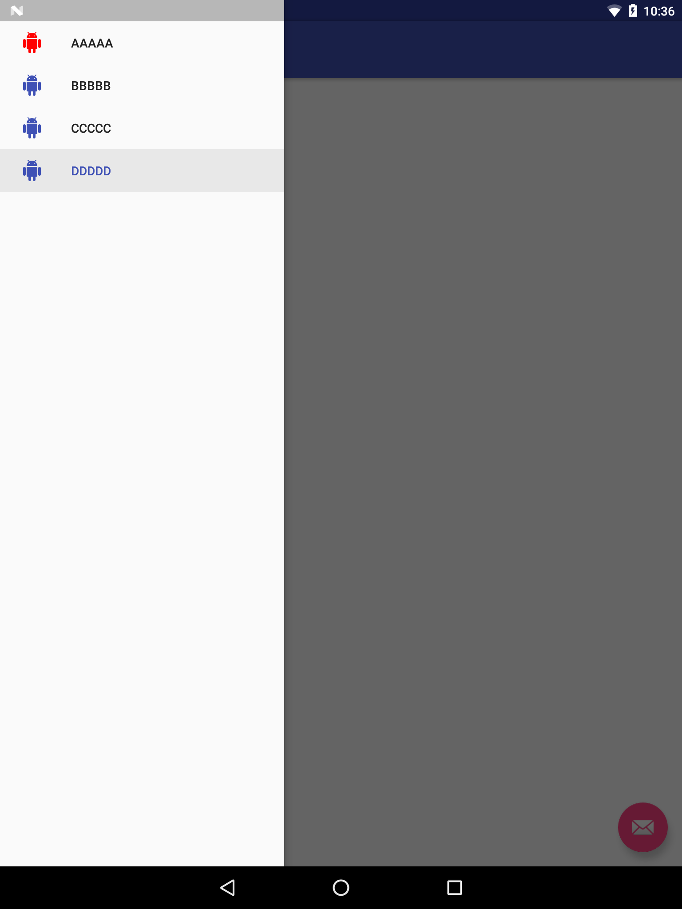

# MaterialDrawerIconTintTest
Shows a bug where a tinted icon stays the selected color

Run the app and click on the FAB. The nav drawer will show, there's four items. The icons are all tinted to be red. We call `setSelection` to select in turn A, then B, then C, then D. We would expect the red tinted color to be restored when the item is no longer selected, but both B and C stay in their selected color on my N9 (Nougat) and on my N6 (Marshmallow) C stays in the selected color. If we just select the items by tapping on them in the nav drawer the colors seem to work as expected.

